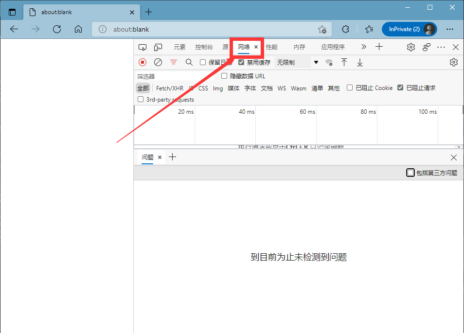
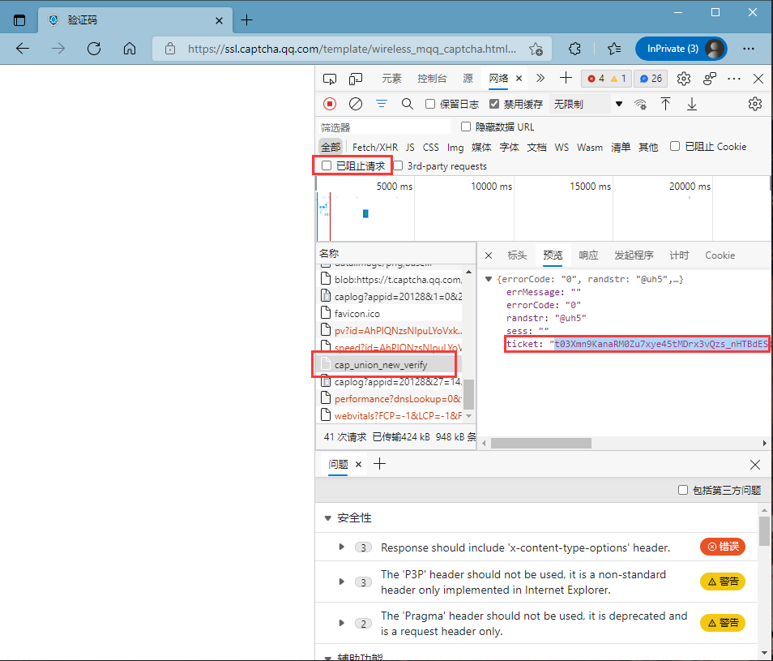

# 登录验证指南

## 文字验证码 <a id="word-captcha"></a>

施工中...

## 滑块验证码 <a id="slide-captcha"></a>

当需要通过滑块验证码进行验证时，通常会看到诸如此类的警告消息（其中10000为机器人QQ号）：

```text
[12:34:56 WARN]: [MiraiMC] 当前登录的QQ（10000）需要滑动验证码验证
[12:34:56 WARN]: [MiraiMC] 请使用手机QQ打开以下链接进行验证
[12:34:56 WARN]: [MiraiMC] https://this.is.link/part
[12:34:56 WARN]: [MiraiMC] 验证完成后，请输入指令 /miraiverify slidercaptcha 10000 <ticket>
[12:34:56 WARN]: [MiraiMC] 如需取消登录，请输入指令 /miraiverify slidercaptchacancel 10000
[12:34:56 WARN]: [MiraiMC] 如需帮助，请参阅: https://wiki.miraimc.dreamvoid.ml/troubleshoot/verify-guide#slide-captcha
```

1. 请使用Chrome、Microsoft Edge等浏览器**打开新标签页**，然后按下**F12**键打开**开发者工具**，并切换到“**网络**”（部分浏览器为“**Network**”）选项卡。如下图（图片看不清可右键图片点击“在新标签页打开图片”）：   
2. **打开插件给出的链接**（如例子中给出的链接是`https://this.is.link/part`）
3. **完成验证**，之后找到**`cap_union_new_verify`**，转到“**预览**”（“**Preview**”），**ticket行**的**引号**内所有内容即为**ticket值**（如果找不到`cap_union_new_verify`，请检查是否勾选了“已阻止请求”）。如下图：   
4. **回到控制台**，执行命令`/miraiverify slidercaptcha 10000 <ticket>`，将相应的值填入，完成验证。（其中10000为机器人QQ号）

## 设备锁 <a id="device-locker"></a>

施工中...


